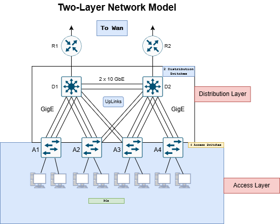

</img>

## Hi there 👋

My name is Nguyen Thanh Hung (Gin), born in 2002.

I am currently a Network Engineer. My work mainly involves computer networks, systems, network architecture, and network automation.

## 🌐 Socials:
    

## 🕸️ Network Model

  
  

